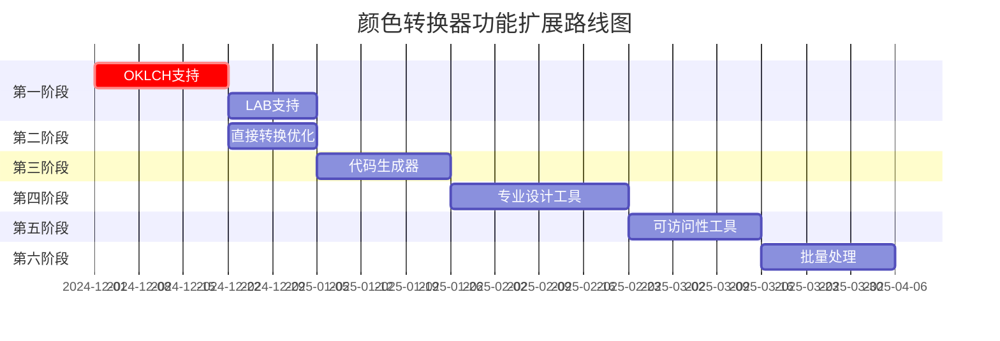

# 颜色转换器功能扩展计划

## 文档信息
- **创建时间**: 2024年12月
- **项目**: RGBA to HEX Color Converter (rgbatohex.com)
- **版本**: v1.0
- **状态**: 规划阶段

## 执行总结

基于用户搜索行为分析和现有功能评估，本文档制定了颜色转换工具的全面扩展计划。重点关注现代颜色空间支持（特别是OKLCH）、开发者工具增强、以及专业设计功能的完善。

## 目录
1. [当前功能评估](#当前功能评估)
2. [用户需求分析](#用户需求分析)
3. [功能扩展规划](#功能扩展规划)
4. [技术实现规格](#技术实现规格)
5. [开发路线图](#开发路线图)
6. [资源评估](#资源评估)

---

## 当前功能评估

### ✅ 已完善实现的功能
- **基础转换**: RGBA↔HEX, RGB↔HSL, RGB↔HSV, RGB↔CMYK
- **扩展转换**: HSV↔HSL, CMYK↔HEX, 8位HEX支持
- **专业功能**: CMYK色域检查, Pantone匹配, 打印适用性评分
- **用户界面**: 实时预览, 响应式设计, 深色模式
- **开发者支持**: 详细API文档, 代码示例（JS/Python）

### ⚠️ 需要优化的功能
- **直接转换路径**: 缺少HSL→RGBA, HSL→CMYK直接函数
- **代码生成**: 仅限基础示例，缺少多语言/框架支持
- **批量处理**: 无批量转换功能
- **现代标准**: 缺少CSS Color Level 4支持

### ❌ 缺失的关键功能
- **现代颜色空间**: OKLCH, LAB, XYZ, LCH
- **专业工具**: 高级色彩和谐，色差计算
- **可访问性**: WCAG AAA检查，色盲模拟
- **企业功能**: 调色板管理，团队协作

---

## 用户需求分析

### 高频搜索需求（基于第一张图片分析）
1. **hsl to oklch** ⭐⭐⭐ - CSS Color Level 4新标准
2. **hsl to rgba** ⭐⭐⭐ - 缺少直接转换
3. **hsl to hex js** ⭐⭐ - 需要增强代码生成
4. **hsl to cmyk** ⭐⭐ - 缺少直接转换
5. **hsl to color** ⭐⭐ - CSS格式扩展需求

### 目标用户群体
- **Web开发者** (40%): 需要现代CSS颜色支持，代码生成
- **UI/UX设计师** (35%): 需要色彩和谐工具，可访问性检查
- **印刷设计师** (15%): 需要专业色彩管理，CMYK优化
- **学生/教育者** (10%): 需要理论解释，公式展示

---

## 功能扩展规划

### 第一阶段：现代颜色空间支持 🌟
**优先级**: 最高 | **预估工期**: 3-4周

#### 1.1 OKLCH颜色空间
```typescript
interface OKLCH {
  l: number; // Lightness (0-1)
  c: number; // Chroma (0-0.4)  
  h: number; // Hue (0-360)
}

// 核心转换函数
export function hslToOklch(hsl: HSL): OKLCH
export function oklchToHsl(oklch: OKLCH): HSL
export function rgbToOklch(rgb: RGB): OKLCH
export function oklchToRgb(oklch: OKLCH): RGB
export function oklchToHex(oklch: OKLCH): string
export function hexToOklch(hex: string): OKLCH
```

**实现要点**:
- 转换链：RGB ↔ XYZ ↔ Oklab ↔ OKLCH
- 支持P3色域
- CSS格式输出：`oklch(0.7 0.15 180)`

#### 1.2 LAB颜色空间
```typescript
interface LAB {
  l: number; // Lightness (0-100)
  a: number; // Green-Red axis (-128 to 127)
  b: number; // Blue-Yellow axis (-128 to 127)
}

interface LCH {
  l: number; // Lightness (0-100)
  c: number; // Chroma (0-150)
  h: number; // Hue (0-360)
}
```

#### 1.3 新增页面路由
- `/tools/hsl-to-oklch/` 和 `/tools/hsl-to-oklch-converter/`
- `/tools/rgb-to-lab/` 和 `/tools/rgb-to-lab-converter/`
- `/tools/oklch-to-hex/` 和 `/tools/oklch-to-hex-converter/`

**路由说明**:
- 标准路由 (如 `/tools/hsl-to-oklch/`): 完整功能页面，包含网站导航和完整UI
- 带`-converter`后缀路由: 独立工具页面，设计为可通过iframe嵌入到其他网站使用，具有简化UI和响应式设计

### 第二阶段：转换路径优化 ⚡
**优先级**: 高 | **预估工期**: 1-2周

#### 2.1 直接转换函数
```typescript
// 消除用户搜索的痛点
export function hslToRgba(hsl: HSL, alpha: number = 1): RGBA
export function hslToCmyk(hsl: HSL): CMYK
export function hsvToRgba(hsv: HSV, alpha: number = 1): RGBA
export function cmykToRgba(cmyk: CMYK, alpha: number = 1): RGBA
```

#### 2.2 性能优化
- 缓存常用转换结果
- 算法优化，减少中间步骤
- Web Worker支持（批量转换时）

### 第三阶段：开发者工具增强 💻
**优先级**: 高 | **预估工期**: 2-3周

#### 3.1 多语言代码生成器
**支持语言**:
- JavaScript (原生, React, Vue, Angular)
- TypeScript
- Python
- Swift (iOS)
- Java/Kotlin (Android)
- CSS (现代语法)
- Sass/SCSS
- PostCSS

**功能特性**:
```typescript
interface CodeGenerator {
  language: 'js' | 'ts' | 'python' | 'swift' | 'java' | 'css';
  framework?: 'react' | 'vue' | 'angular' | 'vanilla';
  format: 'function' | 'class' | 'module' | 'snippet';
  includeValidation: boolean;
  includeComments: boolean;
}
```

#### 3.2 API端点扩展
```typescript
// RESTful API设计
GET /api/convert/hsl-to-oklch?h=240&s=100&l=50
POST /api/convert/batch (支持批量转换)
GET /api/generate/code?from=hsl&to=oklch&lang=js
```

### 第四阶段：专业设计工具 🎨
**优先级**: 中 | **预估工期**: 4-5周

#### 4.1 高级色彩和谐
```typescript
interface ColorHarmony {
  type: 'complementary' | 'triadic' | 'tetradic' | 'analogous' | 'split-complementary' | 'monochromatic';
  baseColor: OKLCH | HSL | RGB;
  variations: ColorVariation[];
}

interface ColorVariation {
  color: ColorFormat;
  relationship: string;
  distance: number; // 色彩距离
}
```

**和谐类型扩展**:
- 分离互补色 (Split-complementary)
- 四元色组 (Tetradic/Square)
- 类比色变化 (Analogous variations)
- 单色调渐变 (Monochromatic gradients)

#### 4.2 色差计算 (Delta E)
```typescript
interface ColorDifference {
  deltaE76: number;   // CIE76 标准
  deltaE94: number;   // CIE94 标准  
  deltaE00: number;   // CIEDE2000 最精确
  perceptualDiff: 'imperceptible' | 'slight' | 'noticeable' | 'significant';
}

export function calculateColorDifference(color1: LAB, color2: LAB): ColorDifference
```

### 第五阶段：可访问性与无障碍 ♿
**优先级**: 中 | **预估工期**: 2-3周

#### 5.1 对比度检查增强
```typescript
interface ContrastCheck {
  ratio: number;
  wcagAA: boolean;
  wcagAAA: boolean;
  wcagLevel: 'fail' | 'aa' | 'aaa';
  suggestions: ColorSuggestion[];
}

interface ColorSuggestion {
  color: ColorFormat;
  adjustment: string;
  newRatio: number;
}
```

#### 5.2 色盲模拟器
```typescript
type ColorBlindnessType = 'protanopia' | 'deuteranopia' | 'tritanopia' | 'protanomaly' | 'deuteranomaly' | 'tritanomaly' | 'achromatopsia';

export function simulateColorBlindness(color: RGB, type: ColorBlindnessType): RGB
```

### 第六阶段：批量处理与管理 📊
**优先级**: 中 | **预估工期**: 3-4周

#### 6.1 批量转换
```typescript
interface BatchConversion {
  input: {
    format: ColorFormat;
    colors: string[];
  };
  output: {
    format: ColorFormat;
    results: ConversionResult[];
  };
  options: {
    skipInvalid: boolean;
    includeMetadata: boolean;
  };
}
```

#### 6.2 调色板管理
```typescript
interface ColorPalette {
  id: string;
  name: string;
  colors: ColorEntry[];
  metadata: PaletteMetadata;
  export: (format: 'ase' | 'sketchpalette' | 'json' | 'css') => string;
}
```

**支持格式**:
- Adobe Swatch Exchange (.ase)
- Sketch Palette (.sketchpalette)
- JSON
- CSS自定义属性
- Sass变量文件

### 第七阶段：现代Web标准 🌐
**优先级**: 低-中 | **预估工期**: 2-3周

#### 7.1 CSS Color Level 4/5 支持
```css
/* 目标生成格式 */
color: oklch(0.7 0.15 180);
color: lab(70% -45 0);
color: color(display-p3 1 0 0);
color: lch(70% 45 180);
color: color-mix(in oklch, red 50%, blue);
```

#### 7.2 色彩空间感知转换
```typescript
interface ColorSpace {
  name: 'srgb' | 'display-p3' | 'rec2020' | 'prophoto-rgb';
  gamut: number[]; // 色域范围
  whitePoint: [number, number]; // 白点坐标
}

export function convertColorSpace(color: RGB, from: ColorSpace, to: ColorSpace): RGB
```

---

## 技术实现规格

### 核心算法库扩展

#### 颜色空间转换矩阵
```typescript
// XYZ转换矩阵 (sRGB → XYZ)
const sRGB_to_XYZ = [
  [0.4124564, 0.3575761, 0.1804375],
  [0.2126729, 0.7151522, 0.0721750],
  [0.0193339, 0.1191920, 0.9503041]
];

// Oklab转换常数
const M1 = [
  [0.8189330101, 0.3618667424, -0.1288597137],
  [0.0329845436, 0.9293118715, 0.0361456387],
  [0.0482003018, 0.2643662691, 0.6338517070]
];
```

#### 性能优化策略
```typescript
// 缓存机制
interface ColorCache {
  maxSize: number;
  get(key: string): ColorFormat | null;
  set(key: string, value: ColorFormat): void;
  clear(): void;
}

// Web Worker 支持
interface WorkerTask {
  type: 'batch-convert' | 'generate-harmony' | 'calculate-contrast';
  data: any;
  callback: (result: any) => void;
}
```

### 数据库设计

#### 新增数据表
```sql
-- 用户调色板存储
CREATE TABLE color_palettes (
  id UUID PRIMARY KEY,
  user_id UUID,
  name VARCHAR(255),
  colors JSONB,
  created_at TIMESTAMP,
  updated_at TIMESTAMP
);

-- 颜色转换历史
CREATE TABLE conversion_history (
  id UUID PRIMARY KEY,
  input_color VARCHAR(50),
  input_format VARCHAR(20),
  output_format VARCHAR(20),
  result JSONB,
  user_session VARCHAR(255),
  created_at TIMESTAMP
);
```

### API设计规范

#### RESTful端点
```typescript
// 基础转换
POST /api/v2/convert
{
  "from": "hsl",
  "to": "oklch", 
  "color": { "h": 240, "s": 100, "l": 50 }
}

// 批量转换
POST /api/v2/convert/batch
{
  "from": "rgb",
  "to": "oklch",
  "colors": [
    { "r": 255, "g": 0, "b": 0 },
    { "r": 0, "g": 255, "b": 0 }
  ]
}

// 色彩和谐生成
POST /api/v2/harmony
{
  "baseColor": { "h": 240, "s": 100, "l": 50 },
  "type": "triadic",
  "format": "oklch"
}
```

---

## 开发路线图

### 时间线总览 (16-20周)



### 里程碑定义

#### 🎯 里程碑 1: 现代颜色空间 (第4周)
- ✅ OKLCH完整转换支持
- ✅ LAB/LCH基础支持  
- ✅ CSS Color Level 4格式输出
- ✅ 新增3个工具页面

#### 🎯 里程碑 2: 核心优化 (第6周)
- ✅ 所有直接转换函数
- ✅ 性能提升30%+
- ✅ 缓存机制实现
- ✅ API v2发布

#### 🎯 里程碑 3: 开发者体验 (第9周)
- ✅ 5种语言代码生成
- ✅ 框架模板支持
- ✅ API端点扩展
- ✅ 文档更新

#### 🎯 里程碑 4: 专业功能 (第13周)
- ✅ 高级色彩和谐算法
- ✅ Delta E色差计算
- ✅ 专业调色板工具
- ✅ 设计师工作流集成

#### 🎯 里程碑 5: 可访问性 (第16周)
- ✅ WCAG AAA检查
- ✅ 完整色盲模拟
- ✅ 对比度建议算法
- ✅ 无障碍设计指南

#### 🎯 里程碑 6: 企业功能 (第20周)
- ✅ 批量处理系统
- ✅ 调色板管理
- ✅ 多格式导入导出
- ✅ 用户系统基础

---

## 资源评估

### 开发资源需求

#### 人力资源 (建议配置)
- **前端开发**: 1人 × 20周 = 20人周
- **后端开发**: 0.5人 × 12周 = 6人周  
- **算法开发**: 0.5人 × 8周 = 4人周
- **UI/UX设计**: 0.3人 × 16周 = 4.8人周
- **测试与QA**: 0.2人 × 20周 = 4人周

**总计**: 约38.8人周 (约9.7人月)

#### 技术债务清理
- 重构现有转换函数 (2周)
- 统一API设计 (1周)
- 性能优化测试 (1周)
- 文档更新维护 (持续)

### 基础设施需求

#### 服务器资源
```yaml
# 生产环境扩展
CPU: +2核 (处理批量转换)
内存: +4GB (缓存优化)
存储: +100GB (用户数据)
CDN: 全球加速节点
```

#### 第三方服务
- **颜色数据库**: Pantone Color Institute API
- **字体服务**: Google Fonts API扩展
- **分析工具**: 用户行为追踪增强
- **备份服务**: 数据库定期备份

### 质量保证策略

#### 测试覆盖率目标
- **单元测试**: 95%+ (颜色转换算法)
- **集成测试**: 90%+ (API端点)
- **端到端测试**: 80%+ (关键用户流程)
- **性能测试**: 100% (所有新功能)

#### 浏览器兼容性
```yaml
目标支持:
  Chrome: 90+
  Firefox: 88+  
  Safari: 14+
  Edge: 90+
  移动端: iOS 14+, Android 10+
  
现代特性降级:
  OKLCH: 降级到HSL显示
  CSS Grid: Flexbox降级
  Web Worker: 主线程降级
```

---

## 风险评估与应对

### 技术风险

#### 🔴 高风险
1. **OKLCH算法复杂性**
   - **风险**: 转换精度问题
   - **应对**: 使用权威算法库，充分测试

2. **性能影响**
   - **风险**: 新功能影响现有性能
   - **应对**: 渐进式加载，性能监控

#### 🟡 中风险
1. **浏览器兼容性**
   - **风险**: 现代CSS功能支持不一致
   - **应对**: 特性检测，优雅降级

2. **用户数据迁移**
   - **风险**: 现有用户数据格式变更
   - **应对**: 向后兼容设计，分步迁移

### 商业风险

#### 市场竞争
- **风险**: 竞争对手快速跟进
- **应对**: 专注用户体验差异化，持续创新

#### 用户接受度
- **风险**: 复杂功能影响易用性
- **应对**: 分层设计，高级功能可选

---

## 成功指标 (KPI)

### 用户参与度
- **新功能使用率**: >30% (3个月内)
- **平均会话时长**: +25%
- **转换完成率**: >95%
- **用户留存率**: +15%

### 技术性能
- **页面加载时间**: <2秒 (99百分位)
- **API响应时间**: <200ms (平均)
- **错误率**: <0.1%
- **可用性**: >99.9%

### 商业影响
- **月活用户**: +40%
- **搜索排名**: 目标关键词前3位
- **开发者API使用**: >1000次/日
- **社区贡献**: GitHub stars +500

---

## 附录

### A. 颜色科学参考
- CIE标准白点坐标
- sRGB色域定义
- Oklab色彩空间论文
- WCAG对比度计算公式

### B. 竞品分析
- Coolors.co: 调色板生成优势
- Adobe Color: 专业工具集成
- Paletton: 色彩理论基础
- 本项目差异化定位

### C. 用户反馈汇总
- GitHub Issues分析
- 用户调研结果
- 功能请求统计
- 痛点问题总结

---

**文档版本**: v1.0  
**最后更新**: 2024年12月  
**审核状态**: 待审核  
**批准人**: 待定 